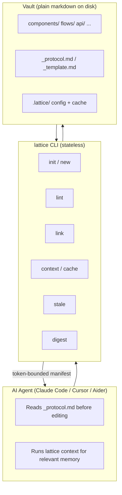
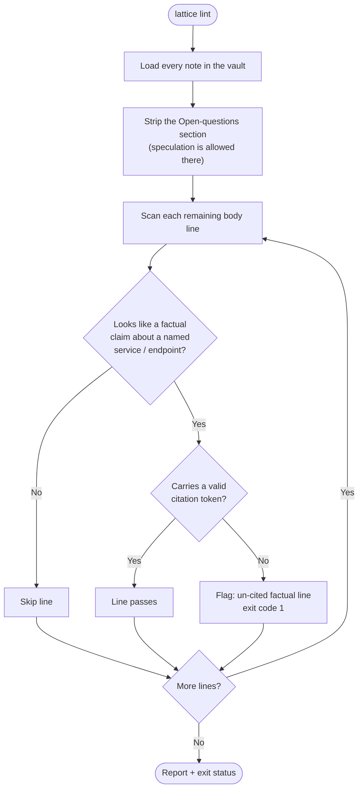
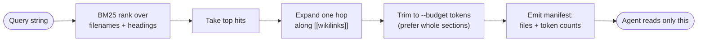
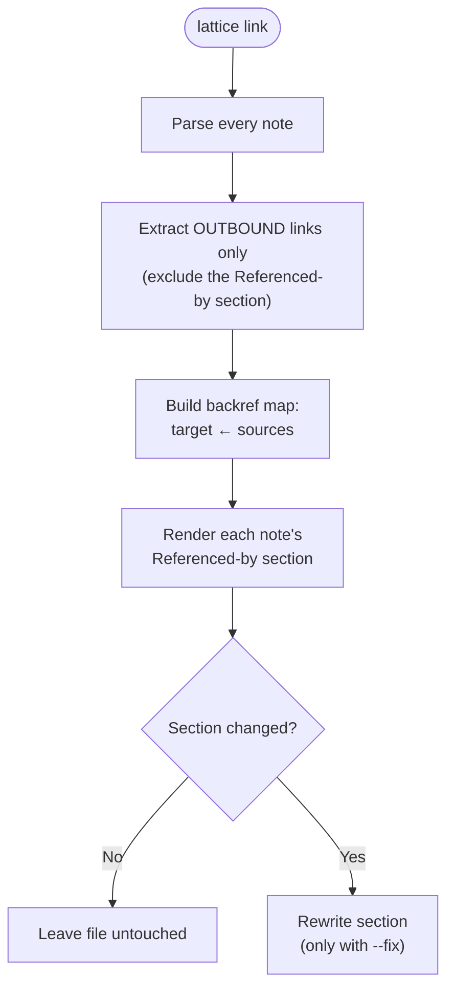

# lattice — Design Document

**Status:** v0.1 · **Audience:** contributors & maintainers · **Scope:** the
CLI, the markdown convention, and the contracts between them.

This document explains *what* lattice is, *why* it is shaped the way it is, and
*how* the pieces fit together. For usage, see the [README](../README.md); for
contribution mechanics, see [CONTRIBUTING](../CONTRIBUTING.md).

---

## 1. Problem & goals

AI coding agents accumulate a single sprawling memory file (`CLAUDE.md` /
`AGENTS.md` / `.cursorrules`) that grows into a multi-thousand-line wiki the
model never fully reads — riddled with speculation it later cites as fact, with
no structure, no freshness signal, and an ever-growing token cost on every
session.

**Goals**

1. Make agent long-term memory **structured, verified, and tool-agnostic**.
2. Reduce tokens spent on memory load by serving **only the relevant subgraph**.
3. Stay **file-native, offline, and dependency-light** — no database, no
   embeddings server. Just markdown + a small CLI.
4. Be **opinionated where it prevents drift**, permissive where rigidity would
   block adoption.

**Non-goals**

- Replacing Obsidian / Logseq / Foam — lattice files live happily inside them.
- Being a vector store or RAG runtime — that is downstream of lattice's job.
- Being a human wiki — humans can read it, but the audience is the agent.

---

## 2. System overview

lattice has two halves: a **markdown convention** (the vault on disk) and a
**stateless CLI** that reads, validates, and queries it. There is no server and
no database; every command is a pure function of the files on disk.



**Why this split:** keeping the CLI stateless and the data in plain markdown
means the vault is portable, grep-able, diff-able, and readable by any agent or
human — with or without lattice installed. lattice adds discipline, never
lock-in.

---

## 3. Directory layout

```
<vault>/
  README.md         # human-facing index (auto-maintained)
  _protocol.md      # update rules the agent reads first
  _template.md      # section skeleton for new notes
  components/       # per-service notes        (configurable types)
  flows/            # end-to-end product paths
  api/              # validated endpoints / payloads
  .lattice/
    config.toml     # token budgets, lint rules, citation schemes, types
    cache/          # pre-rendered context manifests, link/citation indexes
    history/        # compressed session-history digests
```

Category directories are **config-driven** (`[types]` in `config.toml`), with
`components` / `flows` / `api` as zero-config defaults. The loader
auto-discovers any non-hidden directory, so adding a category needs no code
change.

---

## 4. File contract

Every note under a category directory carries frontmatter:

```yaml
---
type: flow | component | api | <your-own>
last_verified: YYYY-MM-DD
related: [other-file-slug, ...]
---
```

Two body sections are mandatory and enforced by `lattice lint`:

- **`## Open questions`** — speculation lives here, dated. Lint blocks un-cited
  claims in the body but accepts them in this quarantine section.
- **`## Referenced by`** — auto-maintained backlinks (`lattice link`).

### Citation schemes (config-driven)

Any factual claim about a named service / repo / endpoint must end with a
citation token. The valid schemes are **vendor-neutral by default** and
extensible per vault:

| Default schemes | Add your own (`[citations] extra`) |
|---|---|
| `file` `doc` `url` `commit` `pr` `conv` `chat` | `jira` `linear` `notion` `confluence` … |

```toml
# .lattice/config.toml
[citations]
extra = ["jira", "linear"]
```

No source system is hardcoded into core — a design rule, not an accident.

---

## 5. The verification gate

The gate is what makes memory *verified by construction*: an un-cited factual
claim physically cannot enter a note's body.



Captions (lines ending in `:` that introduce a block) and fenced code blocks
are excluded from the scan — they are evidence, not claims.

---

## 6. Token-aware retrieval

The expensive part of agent memory is loading a 50K-token vault into a session
that needs 2K of it. `lattice context` returns only the smallest relevant
subgraph, using cheap deterministic retrieval — no embeddings required.



A worked manifest:

```
# lattice context for: "how does checkout settle a payment?"
files: 3   tokens: 2,140 / 4,000
- flows/checkout.md#phase-c-settlement              (1,180 tokens)
- components/payment-gateway.md#1-endpoint            (520 tokens)
- components/payment-gateway.md#3-apis-we-use         (440 tokens)
```

v0.1 stays embedding-free so install is one `pipx`. An optional embedding
backend is planned as an extra (§9) and degrades to BM25 when absent.

---

## 7. Backlink maintenance

`lattice link` keeps `## Referenced by` sections accurate. The critical
correctness property is **idempotency**: links inside a note's own
`Referenced by` section are *inbound* backrefs and must not be counted as
*outbound* links — otherwise repeated runs oscillate and destroy edges.



---

## 8. History compression

`.CLAUDE.HISTORY`-style session logs grow unboundedly and silently dominate
context on every cold start. `lattice digest` compresses sessions older than
`--keep-recent` into 5-line stubs that link to full archives, targeting ~80%
reduction while preserving every citation-worthy fact. An optional Claude
backend produces richer stubs; without an API key it falls back to a
deterministic heuristic.

---

## 9. CLI surface

| Command | Purpose |
|---|---|
| `lattice init [<dir>]` | Scaffold a vault (idempotent) |
| `lattice new <type> <slug>` | Create a note from the template |
| `lattice link [--fix]` | Rebuild `Referenced by` backlinks |
| `lattice lint` | Citations + structure + token budgets |
| `lattice stale [--days N]` | Notes whose `last_verified` is older than N |
| `lattice context <query> [--budget N]` | Smallest relevant subgraph |
| `lattice cache [--build]` | Pre-render context manifests for offline use |
| `lattice digest <history-file>` | Compress a session-history file |

---

## 10. Token-budget enforcement

```toml
# .lattice/config.toml
[budgets]
file_warn = 6000      # lint warns above this
file_max  = 12000     # lint errors above this
context_default = 4000

[lint]
require_citations = true
require_open_questions = true
require_referenced_by = true
```

Files past `file_warn` get a split recommendation; past `file_max`, lint fails.

---

## 11. Roadmap

- **v0.1 (current):** `init`, `new`, `link`, `lint`, `stale`, `context`,
  `cache`, `digest`; config-driven citation schemes and note types.
- **v0.2:** optional embedding backend for `context` (as an extra); agentic
  `verify` (re-check citations against their sources); Mermaid graph export.
- **v0.3:** pluggable source adapters (review-gated auto-capture, git first) —
  the `_inbox/` review gate plus its `inbox` (list) and `promote` (move a draft
  into a templated, still-uncited note) half are implemented; outcome-weighted
  retrieval; multi-vault federation.

Design rules that gate every addition: dependency-light core, no vendor names
in core, opt-in/default-off for anything costly or unattended, and never bypass
the verification gate.
```
